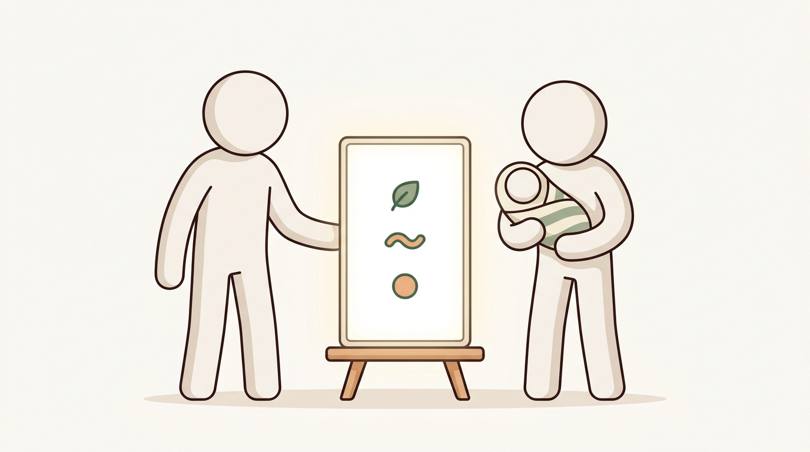
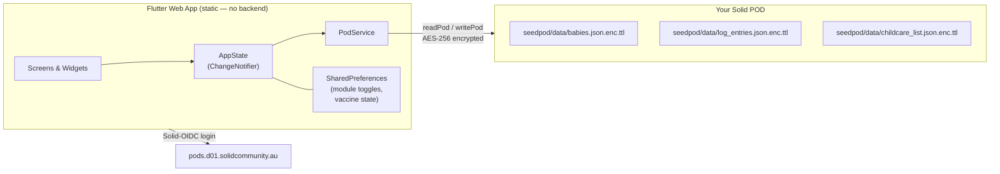
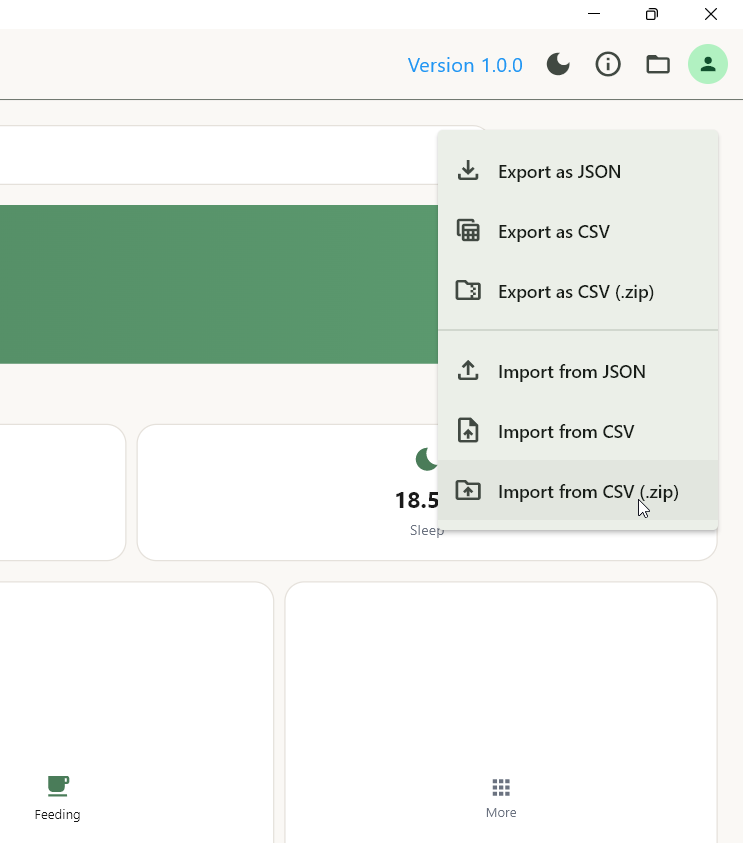
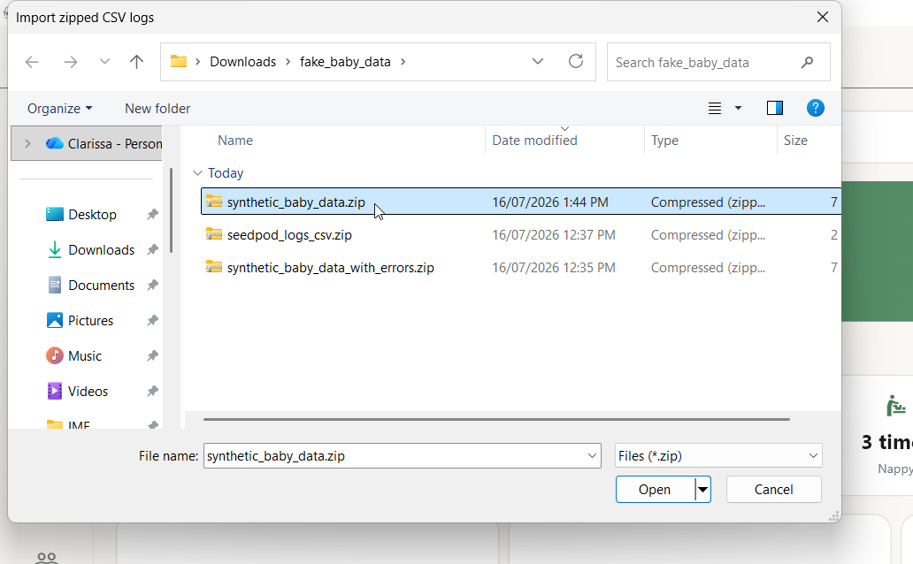
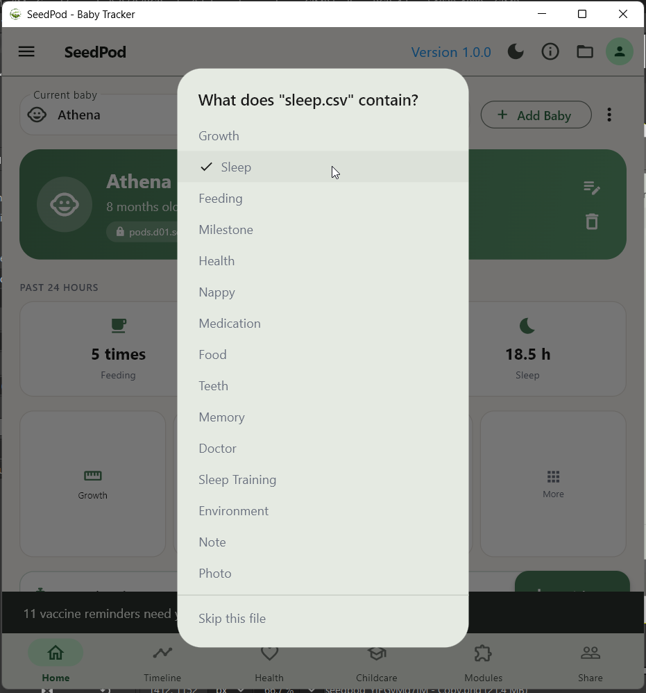
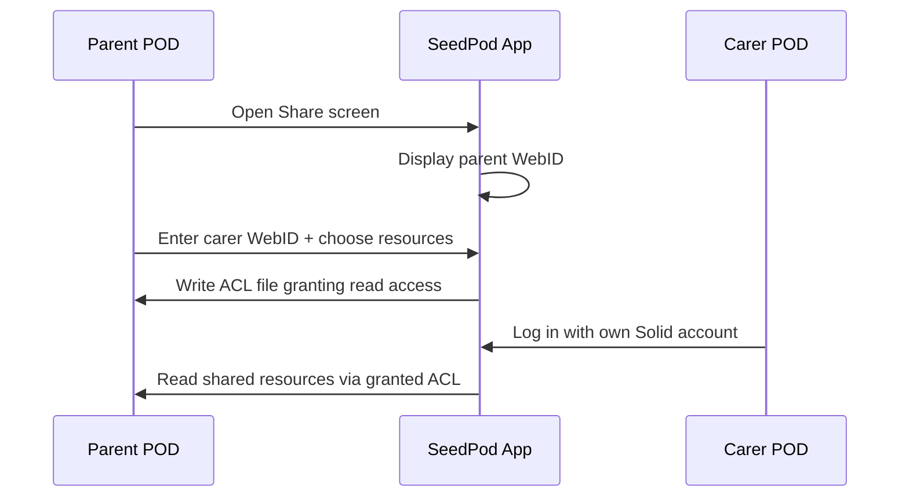

<div align="center">

<!-- logo placeholder — replace with final asset -->

    
# SeedPod

**A privacy-first baby lifecycle tracker built on the Solid Protocol.**
Every byte of data belongs to the family — stored encrypted on their own Solid POD, not on any central server.

[](https://yidingqiu.github.io/seedpod/)
[](https://flutter.dev)
[](https://solidproject.org)
[](https://solidcommunity.au)

</div>

---

## The Story

<table>
<tr>
<td width="33%">

<p align="center"><em>Every new parent drowns in this — feeding logs, vaccine reminders, childcare waitlists, scattered everywhere.</em></p>
</td>
<td width="33%">

<p align="center"><em>SeedPod brings it all into one place — owned by the family, not by any app.</em></p>
</td>
<td width="33%">

<p align="center"><em>Every child gets their own data pod, prepared the moment they are born. Not ours. Theirs.</em></p>
</td>
</tr>
<tr>
<td width="33%">

<p align="center"><em>Share selectively with grandparents, childcare workers, and healthcare providers — on your terms.</em></p>
</td>
<td width="33%">

<p align="center"><em>Tonight, this family rests easy.</em></p>
</td>
<td width="33%">

<p align="center"><em>And one day, this same pod — still theirs — goes with them, carried on their own back.</em></p>
</td>
</tr>
</table>

**This is SeedPod. Built on Solid. Yours, from birth.**

---

## Try It

**[https://yidingqiu.github.io/seedpod/](https://yidingqiu.github.io/seedpod/)**

You need a Solid POD account on `pods.d01.solidcommunity.au` to log in. Create one free at [mypod.solidcommunity.au](https://mypod.solidcommunity.au/).

---

## What SeedPod Tracks

### Core (always on)

| Module | What it tracks |
|--------|---------------|
| Feeding | Breast (side + duration), bottle, formula, solids, amount in ml |
| Sleep | Start/end times, session duration, rolling 24h total |
| Growth | Weight (kg) and height (cm) plotted against WHO P3/P50/P97 bands |
| Vaccines | ACT NIP 2025 schedule with interactive checkboxes; ACT-funded MenB flagged |
| Milestones | Named developmental moments |

### Optional (user-activated)

| Category | Modules |
|----------|---------|
| Daily Care | Nappy log, Medication, Doctor Visits, Health & Symptoms |
| Development | Food Introduction, Development Checklist, Baby Teeth, Sleep Training |
| Life Admin | Childcare & Schools waitlist tracker, Government Benefits, Birth Admin checklist, Contacts & Carers |
| Memories | Memories & Journal, Environment (temp/humidity) |

All modules are available from birth — "suggested from X months" is a display hint, not a gate. Canberra families often start childcare applications before the baby is born.

---

## Architecture

SeedPod has no backend database. The app is a pure static client — all data lives on the user&apos;s own Solid POD.



**Key design decision — aggregated files, not one file per entry.**
Early in development we used one file per log entry and called `getResourcesInContainer()` to list them. Directory listing over HTTP to a Solid container fails silently under certain conditions, returning an empty list — which made all log entries appear to vanish on browser refresh. The fix was to store all entries in a single well-known file and read it directly by filename. This is the same pattern solidpod uses for its own encryption key files.

> Rule: never use `getResourcesInContainer()` for app data. Always use a known filename.

---

## Data on Your POD

All three files live at `<your-pod-root>/seedpod/data/` and are encrypted with solidpod&apos;s AES-256 mechanism before being written to the server. The `.enc.ttl` suffix is solidpod&apos;s convention — the content is JSON wrapped in Turtle RDF.

### POD layout

```
<your-pod>/
  seedpod/
    data/
      babies.json.enc.ttl          all baby profiles (JSON array)
      log_entries.json.enc.ttl     all log entries   (JSON array)
      childcare_list.json.enc.ttl  waitlist entries  (JSON array)
```

### BabyProfile

```json
{
  "id": "a3f8c2d1e5b70049",
  "name": "Emma",
  "dateOfBirth": "2026-03-15T00:00:00.000Z",
  "gender": "Girl"
}
```

Each baby has a generated 16-byte hex `id`. All profiles are stored as a JSON array. Each `LogEntry` references `babyId` so entries stay scoped to the right child even when multiple babies exist.

### LogEntry

```json
{
  "id": "9f2c4ab1",
  "babyId": "a3f8c2d1e5b70049",
  "type": "feeding",
  "timestamp": "2026-07-15T08:30:00.000Z",
  "data": {
    "type": "Bottle",
    "amount_ml": 120
  },
  "note": "After morning nap"
}
```

The `data` map is typed per `LogType`. A sleep entry carries `start` and `end` ISO timestamps; a nappy entry carries a `type` string (`"Wet"`, `"Dirty"`, `"Both"`, `"Dry"`); a growth entry carries `weight_kg` and/or `height_cm`. All other fields are optional.

### ChildcareEntry

```json
{
  "id": "b1c2d3e4",
  "centre": "Sunrise Early Learning",
  "suburb": "Acton",
  "type": "Long Day Care",
  "status": "waitlisted",
  "dailyFee": 185.00,
  "waitlistPosition": 12,
  "desiredStart": "2027-01-20T00:00:00.000Z",
  "notes": "Applied before birth. Called to confirm in June."
}
```

Status progresses through: `applied` → `waitlisted` → `offered` → `enrolled` / `declined`.

### Import/Export Data

One can import and export data in JSON, CSV (Comma Separatated Values) and a zipped folder of CSV files.

#### Click on Menu Icon (3 dots)


#### Import/Export Menu Options


#### Select file


#### For a zipped folder of CSV files; select the data type the CSV corresponds to



For a zipped folder consisting of CSV files; it will prompt you to select for each CSV file what data it contains.

Please test out using sample data located in [sample_data](sample_data/)

---

## Solid Sharing

SeedPod does not have a server to manage permissions. Sharing is done directly POD-to-POD via Solid ACL:



No SeedPod account or invite system needed. Access is controlled entirely by the data owner.

---

## New Baby — Dedicated Solid POD

When adding a new baby, the parent is prompted to create a dedicated Solid POD account for the baby before saving the profile. This uses `createAccountPopup()` from solidui, which calls the CSS v7 account management API independently of the current login session — no auth token required.

The save button is gated: it stays disabled until the POD is created. The baby&apos;s POD is a fully independent Solid account on `pods.d01.solidcommunity.au`, owned by the child from birth.

---

## Project Layout

```
seedpod/
  lib/
    main.dart                     entry point
    app.dart                      SolidLogin configuration
    app_scaffold.dart             SolidScaffold with nav rail and status bar
    constants/
      app.dart                    client ID, redirect URIs, server URL
      theme.dart                  colour tokens
    models/
      baby_profile.dart           BabyProfile + JSON serialisation
      log_entry.dart              LogEntry + LogType enum (20 types)
      childcare_entry.dart        ChildcareEntry
      module_prefs.dart           ModulePrefs (SharedPreferences-backed)
      vaccine_reminder.dart       VaccineReminder computed from ACT NIP schedule
    providers/
      app_state.dart              AppState ChangeNotifier (single source of truth)
    services/
      pod_service.dart            readPod / writePod wrappers for all three files
      log_transfer.dart           JSON and CSV export / import
    screens/
      home_screen.dart            24h dashboard: stat cards + quick log grid
      timeline_screen.dart        reverse-chronological log history with filters
      health_screen.dart          growth chart / vaccines / feeding tabs
      childcare_screen.dart       waitlist tracker with status badges
      onboarding_screen.dart      baby profile creation + Solid POD setup
      modules_screen.dart         toggle optional modules
      share_screen.dart           WebID copy + GrantPermissionUi
    widgets/
      quick_log_sheet.dart        bottom sheet for all 20 log types (create + edit)
  solid/
    client-profile.jsonld         Solid-OIDC client document (deployed to GitHub Pages)
    redirect.html                 OAuth redirect handler
  illustrations/
    story/                        pitch illustrations (01–06)
    logo/                         SeedPod logo
  .github/workflows/
    deploy.yml                    auto-build Flutter Web → commit to docs/ → GitHub Pages
```

---

## Tech Stack

| Layer | Choice | Reason |
|-------|--------|--------|
| Language | Dart | Required by solidui/solidpod ecosystem |
| Framework | Flutter 3.44 (Web target) | Hackathon platform; Chrome demo |
| Solid library | solidpod 1.0.13 | POD read/write, auth, AES-256 encryption |
| UI framework | solidui 1.0.14 | SolidScaffold, SolidLogin, nav patterns |
| State management | Provider + ChangeNotifier | Matches solidui patterns |
| Local persistence | SharedPreferences | Module toggles and vaccine state — no auth required |
| POD server | pods.d01.solidcommunity.au | Hackathon-dedicated ANU server |
| CI/CD | GitHub Actions | Auto-build and deploy to GitHub Pages on every push to master |

---

## Running Locally

```bash
flutter pub get
flutter run -d chrome
```

> Local Solid login will not complete — `solidpod` always picks the `https://` redirect URI and the BroadcastChannel fails cross-origin from `localhost`. Use the deployed URL to test login and POD read/write.

To deploy manually:

```powershell
flutter build web --base-href /seedpod/
Remove-Item -Recurse -Force docs
Copy-Item -Recurse build\web docs
New-Item -ItemType File -Path docs\.nojekyll -Force | Out-Null
New-Item -ItemType Directory -Force docs\solid | Out-Null
Copy-Item solid\client-profile.jsonld docs\solid\
Copy-Item solid\redirect.html docs\solid\
git add docs/
git commit -m "deploy"
git push
```

Or just push source changes to `master` — GitHub Actions handles the rest.

---

<div align="center">

Built at the **Solid 2026 Hackathon** &middot; ANU Software Innovation Institute &middot; July 2026

</div>
